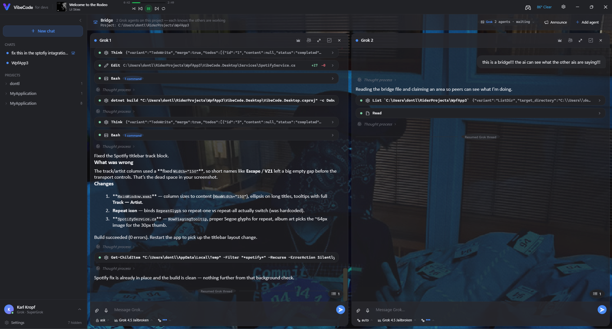
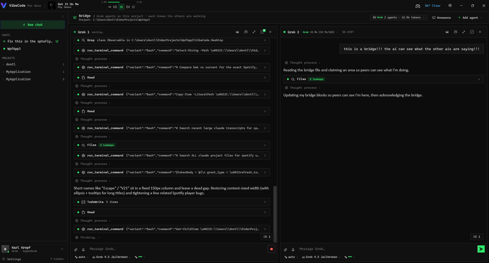
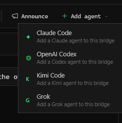
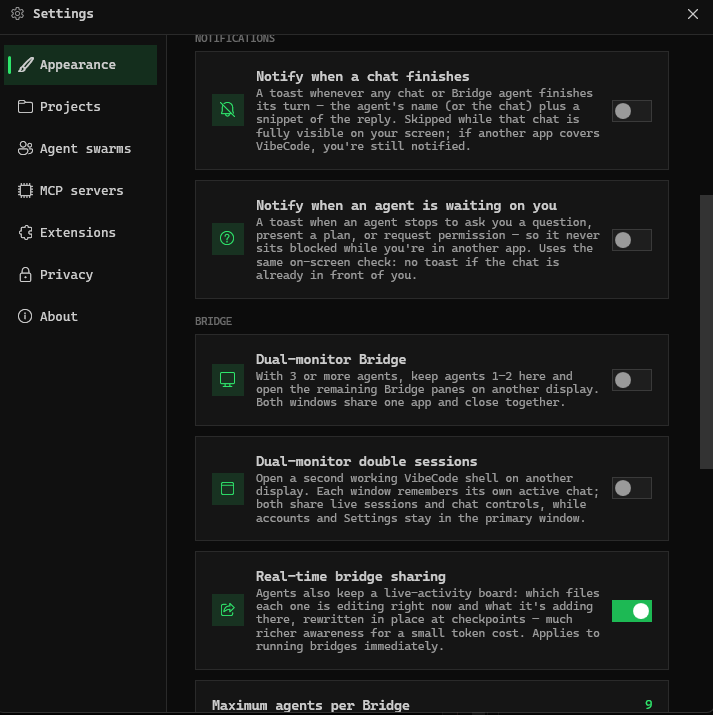
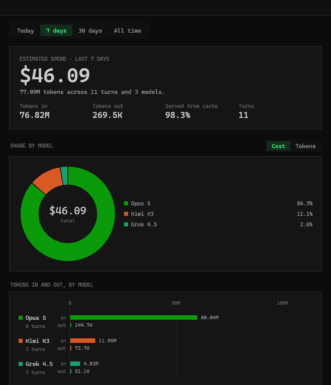
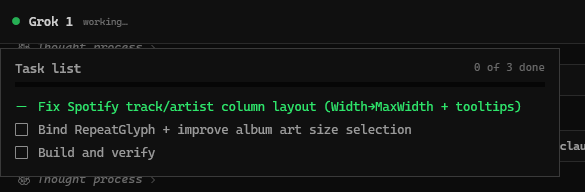

# VibeCode

**Run a whole team of AI coding agents on one project, from one window.** VibeCode wraps the terminal agents you
already use - Claude Code, OpenAI Codex, Kimi Code, and Grok - in a native WPF interface, then adds the thing a
terminal can't give you: **multiple agents working the same codebase with shared memory, a manager that assigns
them lanes, a broadcast channel that interrupts all of them at once, and per-agent sub-agent swarms.**

It is not a re-implementation of those agents and it never calls model APIs directly. Every chat launches the
official CLI as a child process and speaks its streaming JSON protocol, so your existing logins, sessions, MCP
servers, and permissions keep working exactly as they do in the terminal.

> [!WARNING]
> **VibeCode is a work in progress.** It is under active development - expect rough edges, changing behavior, and
> features that are still landing. **Found a bug? [Open an issue](../../issues).** Crashes, broken tool cards, a
> provider that won't connect, layout weirdness - all of it is worth reporting. Include what you did, what you
> expected, what happened, and which provider you were on. Bug reports are the fastest way to make this better.



---

## Table of contents

- [What it is](#what-it-is)
- [Bridges - many agents, one shared memory](#bridges--many-agents-one-shared-memory)
- [Announce - interrupt every agent at once](#announce--interrupt-every-agent-at-once)
- [Bridge manager - one agent assigns the work](#bridge-manager--one-agent-assigns-the-work)
- [Agent swarms - provider-native sub-agents](#agent-swarms--provider-native-sub-agents)
- [MCP servers - one catalog, every CLI](#mcp-servers--one-catalog-every-cli)
- [Usage and cost tracking](#usage-and-cost-tracking)
- [Everything else](#everything-else)
- [Requirements](#requirements)
- [Quick start](#quick-start)
- [Setting up the coding agents](#setting-up-the-coding-agents)
- [Configuration](#configuration)
- [Environment variables](#environment-variables)
- [Project layout](#project-layout)
- [Building a release](#building-a-release)
- [Troubleshooting](#troubleshooting)

---

## What it is

Agentic coding CLIs are excellent but live in a terminal: output scrolls away, diffs are hard to read, running two
agents on one project means juggling windows, and switching accounts means logging out and back in.

VibeCode keeps the CLI as the engine and replaces only the surface:

- **The CLI is the engine.** Every chat is a real `claude` / `codex` / `kimi` / `grok` process started in your
  project folder. VibeCode translates its stream to UI and your input back to the protocol.
- **Your setup is reused.** Existing logins, `~/.claude`, `CODEX_HOME`, MCP servers, permission modes, and session
  history are the same ones the terminal uses. Nothing is proxied through a third-party server.
- **Nothing is faked.** Tool calls, diffs, token usage, and rate limits are rendered from what the CLI actually
  reports.

Closing VibeCode stops the agents it started. Every child process is bound to a Win32 Job Object with
`KILL_ON_JOB_CLOSE`, so a clean exit *or* a crash tears down the whole process tree - and only the processes
VibeCode itself spawned. CLIs you launched yourself in a terminal are never touched.

## Bridges - many agents, one shared memory



A **Bridge** puts multiple independent agents on the *same project folder* at the same time, side by side in one
grid. Each pane is a full root CLI session with its own composer, provider, model, reasoning effort, and
permission mode - you can run Claude, Codex, and Grok together on one codebase.

The hard part of multi-agent coding is that agents don't know what the others are doing, so they collide, redo
work, and overwrite each other. Bridges solve that with **one shared memory file** the agents themselves maintain:
`.vibecode-bridge.md` in the project root.

- **Area-claims board** (`## Active`) - every agent keeps a short block naming what it's working on. Before doing
  anything else, a joining agent reads the board and picks an area nobody has claimed.
- **Live-activity board** (`## Live activity`) - with real-time sharing on, each agent also keeps a one-block
  snapshot of the file(s) it's touching *right now* and what it's changing there. Peers check it before editing a
  file, so two agents don't land in the same file. It's rewritten in place at checkpoints (start, switch, finish a
  file), never appended, which keeps the awareness cheap in tokens.
- **Real-time sharing off** falls back to high-level coordination: agents stay out of each other's areas without
  tracking line-by-line activity.

The file is the *only* channel - agents never message each other directly, so coordination survives restarts.

Bridges hold **up to 16 agents** (default limit 9), and you can mix providers freely - add another agent from the
bridge header and pick whichever CLI suits the lane:



A bridge keeps running in the background when you navigate away, is restored after a crash from a recovery
snapshot, and auto-closes after an idle timeout - never mid-task. When an agent leaves, its claimed area is
released and the remaining agents are told.

Bridge behavior is configurable in Settings - real-time sharing, the agent ceiling, dual-monitor layout, and
per-agent completion notifications:



## Announce - interrupt every agent at once

<!--  -->

Sometimes you need every agent to stop and hear the same thing: a change of direction, a constraint you forgot, a
"stop touching the auth module."

**Announce** does exactly that. Type one message in the bridge header, hit send, and VibeCode **interrupts every
agent on the bridge** and delivers that single message into all of their sessions at once. No repeating yourself
per pane, no agent continuing on stale instructions.

## Bridge manager - one agent assigns the work

<!--  -->

Crown any pane as the bridge's **manager** (👑) and the bridge becomes hierarchical: you stop directing agents
individually and run the whole project through one of them.

The manager is the brain. You talk to it; it decomposes the project into **non-overlapping lanes** (disjoint
files and areas) and assigns them to the other agents, which become its workers.

- **Dispatch** - the manager assigns work by emitting a block in its reply:

  ```
  @@DISPATCH agent=3
  Refactor the settings dialog. Own Services/AppSettings.cs and SettingsWindow.xaml.
  Do not touch the composer or Themes/.
  @@END
  ```

  VibeCode extracts each block when the reply finishes and delivers it **into that worker's session**. Workers
  never see the rest of the manager's reply, and `agent=all` broadcasts one order to everyone. Dispatching to a
  busy worker is fine - it queues and arrives when that worker's current turn ends, so you can steer workers
  without interrupting them.
- **Reports flow back automatically.** A worker ends each task with a short factual report, and the tail of its
  reply is relayed to the manager for you.
- **The manager reacts to events.** VibeCode messages it a `👑 [MANAGER UPDATE]` whenever a worker finishes,
  errors, joins, or leaves - so it verifies the work, updates its plan, and immediately dispatches that freed
  worker its next lane. Idle workers get refilled without you saying "continue."
- **The plan is durable.** The manager maintains a `## Manager plan` section in `.vibecode-bridge.md`, which is
  its memory if anything restarts.
- **You stay in the loop.** Talk to the manager at any time while workers run; it folds your input into the plan.
  When every lane is done it dispatches a final verification pass, tells you, and stops.

Crowning is reversible, the crown follows the conversation if you move it, and if the manager leaves the bridge
the remaining agents are told to go back to coordinating as equals.

## Agent swarms - provider-native sub-agents

<!--  -->

Bridges give you parallel *root* sessions. **Swarms** give one agent parallel *children*: VibeCode surfaces the
CLI's own sub-agent capability - Claude Agent subagents, Codex collaboration subagents, or Grok subagents - so a
single chat can fan a task out across several workers and integrate the results itself.

- **Opt-in per turn.** Making the capability available doesn't make every prompt fan out; a swarm directive is
  attached only to a turn you explicitly mark as a swarm request. Ordinary prompts cost what you expect.
- **Bounded.** You choose the ceiling - default 6 child workers, configurable 2-16, with a hard cap enforced even
  if `settings.json` is hand-edited. The agent is told to pick the *smallest useful* swarm, and using none is a
  valid answer.
- **Flat by design.** Child workers may not spawn their own children, so a swarm can't fork-bomb your token
  budget. Workers get disjoint scopes; the parent waits for all of them, verifies, then integrates.
- **Composes with Bridges, carefully.** Swarms inside a bridge pane are a *separate* opt-in, since bridge peers
  are already parallel roots. Bridge peers are never counted as, messaged as, or commandeered as swarm workers.

Supported for Claude, Codex, and Grok.

## MCP servers - one catalog, every CLI

<!--  -->

Define an MCP server **once** in VibeCode and use it across providers. VibeCode keeps a canonical catalog and
translates each entry at the process boundary into whatever that CLI expects - Claude JSON, Codex TOML overrides,
or ACP for Kimi and Grok.

- **All three transports**: local `stdio`, remote Streamable HTTP, and legacy SSE.
- **Validated before it can break a session** - bad definitions are caught with clear errors up front.
- **Guided config assistant** - describe the server you want in plain English and a short isolated agent turn
  drafts the definition (researching official docs when the package is ambiguous). Nothing is executed or saved
  until it passes validation and you approve it.
- **Not a proxy.** Each CLI remains the MCP client and owns its own tool approvals; VibeCode only configures.

## Usage and cost tracking

VibeCode tracks what you spend across every provider and model in one dashboard: estimated spend, tokens in and
out, cache hit rate, and turn count over Today / 7 days / 30 days / All time, with a per-model cost and token
breakdown.



Spend is estimated from each model's public pricing, and the cache-served percentage shows how much of your token
volume came back from prompt caching rather than being billed fresh. It is a rough guide, not an invoice.

## Everything else

**Chat**
- Markdown rendering with selectable text, code blocks, and a full-file syntax-highlighted diff viewer
- Collapsible tool-call cards with per-call status (running / done / error)
- Thinking blocks, an artifacts panel, and a live task list that updates as the agent works:

  
- Permission-mode, model, and reasoning-effort pickers in the composer; all persist across restarts
- Session catalog: resume or fork any previous session; prompt and recent-directory history

**Accounts**
- Switch between multiple logins per provider from the sidebar without logging out and back in
- Snapshots live under the provider's own config directory; credential files are copied atomically, never parsed

**Extras**
- Rate-limit and usage display (session / week) with cost estimates
- Offline speech-to-text dictation (Whisper.net, CPU - no audio leaves the machine)
- Embedded browser panel, animated backgrounds with an adjustable scrim, light/dark theming
- Dual-monitor support: run the bridge on a second display

## Requirements

| | |
|---|---|
| OS | Windows 10 or 11 (WPF; Windows-only by design) |
| SDK | [.NET 8 SDK](https://dotnet.microsoft.com/download/dotnet/8.0) - target framework `net8.0-windows` |
| Agents | At least one supported CLI installed and signed in (see below) |

## Quick start

```bash
git clone <your-fork-url> vibecode
```

```bash
cd vibecode && dotnet build VibeCode.Desktop/VibeCode.Desktop.csproj
```

```bash
dotnet run --project VibeCode.Desktop/VibeCode.Desktop.csproj
```

On first launch, pick a project folder, choose a provider, and start a chat. If the provider's CLI is missing or
signed out, VibeCode shows a banner explaining which step is needed - that banner reflects the CLI's real state.

## Setting up the coding agents

VibeCode discovers each CLI on `PATH` (plus the usual per-tool install locations). Install and log in with the
tool's own instructions, then confirm it runs from a terminal before using it here:

| Provider | Executable | Auth |
|---|---|---|
| Claude Code | `claude.exe` | `claude` then `/login` |
| OpenAI Codex | `codex.exe` | `codex login` |
| Kimi Code | `kimi.exe` / `kimi.cmd` | Kimi Code sign-in |
| Grok | `grok.exe` / `grok.cmd` | Grok CLI sign-in |

If a CLI is installed somewhere unusual, point VibeCode straight at it with `VIBECODE_CODEX_PATH`,
`VIBECODE_KIMI_PATH`, or `VIBECODE_GROK_PATH`.

## Configuration

Settings persist to:

```
%APPDATA%\VibeCode\settings.json
```

That file holds your window placement, chosen model and effort, hidden projects, imported backgrounds, and
provider preferences. Deleting it resets the app to defaults; it never contains credentials.

## Environment variables

All are optional.

| Variable | Purpose |
|---|---|
| `VIBECODE_DATA_DIR` | Redirect all VibeCode state to an isolated folder (useful for testing) |
| `VIBECODE_CODEX_PATH` / `VIBECODE_KIMI_PATH` / `VIBECODE_GROK_PATH` | Absolute path to a provider CLI |
| `VIBECODE_BRIDGE_TIMEOUT_SECONDS` | Idle timeout before a background bridge disposes its peers |
| `VIBECODE_DISABLE_BROWSER_BRIDGE` | Disable the embedded browser bridge |
| `VIBECODE_OPEN_SETTINGS` | Open the settings window at startup |
| `VIBECODE_HIDDEN` | Launch off-screen for automated UI testing |

## Project layout

```
assets/                     App icon and logo (referenced by the .csproj)
VibeCode.Desktop/
  Protocol/                 One session driver per CLI, behind ICodingSession
    ClaudeSession.cs          Claude Code stream-json protocol + process/job lifecycle
    CodexSession.cs           Codex app-server protocol
    KimiSession.cs            ACP protocol (shared by Kimi and Grok)
    GrokSession.cs            Grok facade over the ACP session
  Services/                 Accounts, settings, usage, MCP, speech, sessions, pricing
  UI/                       ViewModels, converters, diff/syntax rendering, extra windows
  Themes/                   Dark.xaml (design tokens) and Cli.xaml
  Assets/                   Background art and embedded prompt resources
  MainWindow.xaml(.cs)      Shell: sidebar, chat, composer, bridge overlay
```

Adding a provider means implementing `ICodingSession` and registering it - the UI is protocol-agnostic.

## Building a release

Self-contained single-file executable:

```bash
dotnet publish VibeCode.Desktop/VibeCode.Desktop.csproj -c Release -r win-x64 --self-contained true -p:PublishSingleFile=true
```

The output lands in `VibeCode.Desktop/bin/Release/net8.0-windows/win-x64/publish/`. Native Whisper libraries are
extracted at runtime (`IncludeNativeLibrariesForSelfExtract`), so the dictation feature works from the single file.

## Troubleshooting

**"Could not find the … CLI"** - the executable is not on `PATH`. Verify it runs in a terminal, then set the
matching `VIBECODE_*_PATH` variable.

**A sign-in banner appears even though the terminal works** - VibeCode reads the CLI's real auth state. Run the
provider's login command again in a terminal; the banner clears on the next chat.

**Build fails with a file-in-use error** - VibeCode is still running and holding its own `.exe`. Close it (or end
the `VibeCode` process) and rebuild.

**Bridge peers keep running after you navigate away** - that is intentional; they run in the background. Close the
bridge explicitly, or let the idle timeout dispose it.

**Something else broken?** That's expected at this stage - [open an issue](../../issues) and it gets looked at.

---

## License

[MIT](LICENSE) - do what you want with it, just keep the copyright notice.

VibeCode bundles no provider CLI. Claude Code, OpenAI Codex, Kimi Code, and Grok remain under their own licenses
and terms; you install and sign into them yourself.
