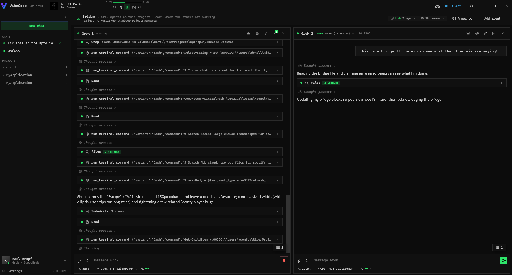
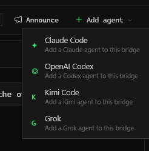
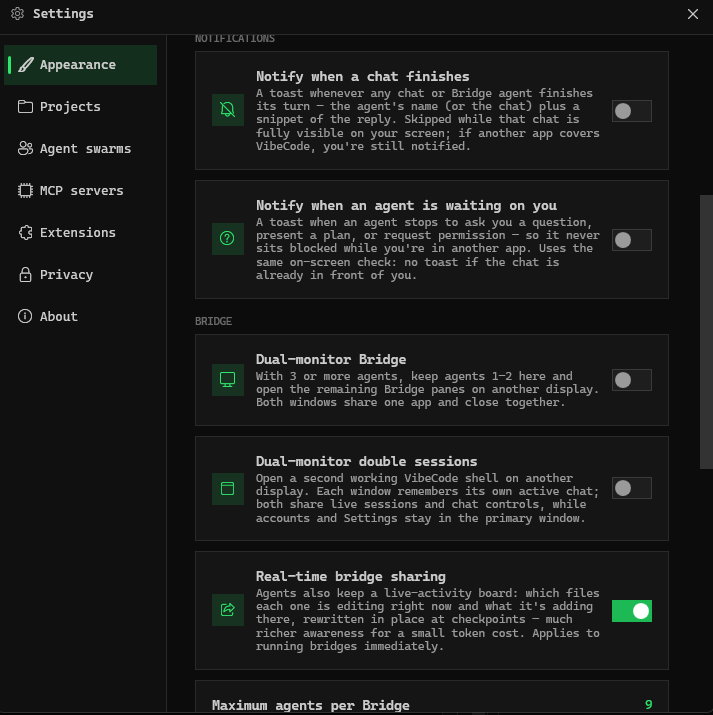
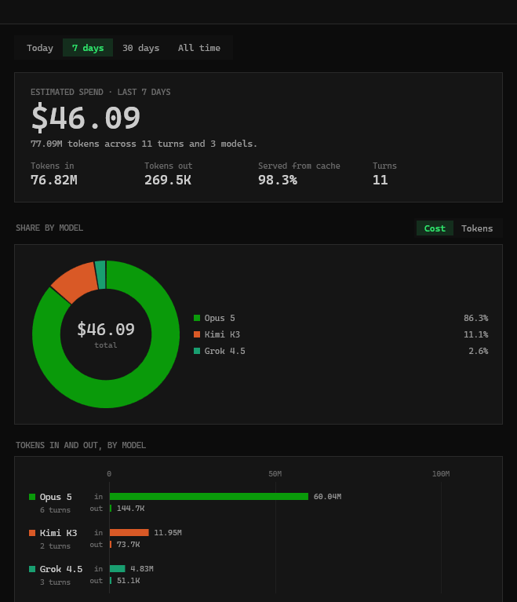
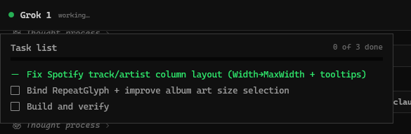

# VibeCode

**Run a team of AI coding agents from one Windows app.** VibeCode brings Claude Code, OpenAI Codex,
Kimi Code, Grok, and GLM together with shared bridge activity, account switching, session recovery, and usage tracking.
Jarvis adds a desktop assistant you can speak to or type to for help with VibeCode and everyday tasks.

### Advanced bridges

[](https://github.com/SeanDishman/vibecode/blob/main/assets/screenshots/advanced-bridge.png)

An orchestrator assigns work to its own workers while the shared terminal shows the team's messages, tool calls,
and edits. Track the plan, inspect each agent, and choose its review level from the sidebar.
[Read the advanced bridge guide.](#advanced-bridges---orchestrators-and-workers)

### Jarvis

[](https://github.com/SeanDishman/vibecode/blob/main/assets/screenshots/jarvis-settings.png)

Ask Jarvis how VibeCode works, open a project, hand a task to a coding chat, adjust settings, or use supported
Windows app actions. Its own settings let you pick a provider and model, preview a voice, and set speech speed and volume.
[Read the Jarvis guide and example questions.](#jarvis---your-desktop-assistant)

> [!WARNING]
> **VibeCode is a work in progress.** It is under active development - expect rough edges, changing behavior, and
> features that are still landing. **Found a bug? [Open an issue](https://github.com/SeanDishman/vibecode/issues).** Crashes, broken tool cards, a
> provider that won't connect, layout weirdness - all of it is worth reporting. Include what you did, what you
> expected, what happened, and which provider you were on. Bug reports are the fastest way to make this better.

---

## Table of contents

- [What it is](#what-it-is)
- [Bridges - multiple agents, one project](#bridges---multiple-agents-one-project)
- [Announce - interrupt every agent at once](#announce---interrupt-every-agent-at-once)
- [Advanced bridges - orchestrators and workers](#advanced-bridges---orchestrators-and-workers)
- [Agent swarms - provider-native sub-agents](#agent-swarms---provider-native-sub-agents)
- [Queues and the orchestrator wall](#queues-and-the-orchestrator-wall)
- [Jarvis - your desktop assistant](#jarvis---your-desktop-assistant)
- [Second Brain - memory across chats](#second-brain---memory-across-chats)
- [MCP servers - one catalog, every CLI](#mcp-servers---one-catalog-every-cli)
- [Usage and cost tracking](#usage-and-cost-tracking)
- [Android companion](#android-companion)
- [Everything else](#everything-else)
- [Requirements](#requirements)
- [Quick start](#quick-start)
- [Setting up the coding agents](#setting-up-the-coding-agents)
- [Configuration](#configuration)
- [Environment variables](#environment-variables)
- [Project layout](#project-layout)
- [Building a release](#building-a-release)
- [Troubleshooting](#troubleshooting)

---

## What it is

Agentic coding CLIs are excellent but live in a terminal: output scrolls away, diffs are hard to read, running two
agents on one project means juggling windows, and switching accounts means logging out and back in.

VibeCode keeps the CLI as the engine and replaces only the surface:

- **The CLI is the engine.** Claude, Codex, Kimi, and Grok chats run their respective CLI in your project folder.
  VibeCode translates its stream to UI and your input back to the protocol. GLM uses its own API adapter.
- **Your setup is supported.** Provider configuration, MCP servers, permission modes, and session history stay
  part of the workflow. Managed accounts use separate credential storage so you can switch accounts in the app.
- **Activity comes from the provider.** Tool calls, diffs, usage, and rate limits reflect provider reports.
  Live token estimates are marked with `~` and reconciled when reported totals arrive.

With **Run in background** enabled, closing the window keeps ongoing work running in the system tray. Use
**Quit** to end the app, or disable background running in Settings. The app binds its CLI children to Win32 Job
Objects so exiting or crashing cleans up the processes it owns. Independently launched terminal sessions keep
their own lifetime.

## Bridges - multiple agents, one project



A **Bridge** runs multiple independent agents in the same project folder. Every agent has its own chat,
provider, model, reasoning effort, account, and permission mode. Mix providers and choose a team that fits the work.

Agents coordinate through built-in bridge tools: they can discover the roster, name their task, report activity,
send peer messages, read their inbox, and inspect recent file edits. VibeCode records which agent changed which
file and lines, with seven days of edit history available to peers. That history helps agents coordinate when
their changes overlap; a file listed on a task is an activity hint, not an editing lock.

Peer conversation lookup provides additional context for handoffs. Bridge messages, tasks, and recovery state
are maintained by the app, so agents can pick up their work after a restart. The project-level
`.vibecode-bridge.md` file remains available for bridge context.

Bridges support **up to 17 root agents**, with a default ceiling of 9. Add agents from the bridge header:



The team keeps working when you switch chats. Recovery snapshots restore the bridge after a crash, and an idle
timeout closes inactive sessions. Configure the agent ceiling, peer messaging, second-display layout, and
completion notifications in Settings.



## Announce - interrupt every agent at once

<!--  -->

Sometimes you need every agent to stop and hear the same thing: a change of direction, a constraint you forgot, a
"stop touching the auth module."

**Announce** does exactly that. Type one message in the bridge header, hit send, and VibeCode **interrupts every
agent on the bridge** and delivers that single message into all of their sessions at once. No repeating yourself
per pane, no agent continuing on stale instructions.

## Advanced bridges - orchestrators and workers

Use an **advanced bridge** when a task benefits from a team with an orchestrator. Choose the orchestrator and
workers in bridge setup, or arrange several orchestrator groups within the bridge's agent ceiling. Each group
has its own workers, and each agent can use a different provider, model, and reasoning effort.

The **shared activity feed** brings messages, tool calls, edits, and progress into one view, with the responsible
agent shown beside each entry. The sidebar shows each agent's assignment, status, unread messages, and review
level. Use the composer’s **Send to** control to address the agent you want to steer.

- **Plans and tasks:** orchestrators publish steps with stable task IDs, owners, and dependencies. Progress and
  plan details remain visible while the team works.
- **Delegation and handoffs:** an orchestrator dispatches assignments to its own workers, receives their results,
  and assigns further work as dependencies finish. Workers can communicate across groups when messaging allows it.
- **Coordination before dispatch:** multiple groups agree on the division of work, or use a temporary central
  orchestrator to prepare the assignments. The app tracks the plan version and opens dispatch when the groups are ready.
- **Reviews you control:** select **None**, **Low**, **Normal**, or **High** per agent. None skips optional review;
  Low permits one quick pass, Normal one focused pass, and High up to two passes. Requested checks still apply.
- **Recovery:** plans, tasks, inbox state, and review results are saved with the bridge. Interrupted tasks can be
  retried without losing the team’s progress.

Direct the orchestrator from its chat while watching worker activity in the shared feed. You can also inspect
individual agents and change direction as the task develops.

## Agent swarms - provider-native sub-agents

<!--  -->

Bridges give you parallel *root* sessions. **Swarms** give one agent parallel *children*: VibeCode surfaces the
CLI's own sub-agent capability - Claude Agent subagents, Codex collaboration subagents, or Grok subagents - so a
single chat can fan a task out across several workers and integrate the results itself.

- **Opt-in per turn.** Making the capability available doesn't make every prompt fan out; a swarm directive is
  attached only to a turn you explicitly mark as a swarm request. Ordinary prompts cost what you expect.
- **Bounded.** You choose the ceiling - default 6 child workers, configurable 2-16, with a hard cap enforced even
  if `settings.json` is hand-edited. The agent is told to pick the *smallest useful* swarm, and using none is a
  valid answer.
- **Flat by design.** Child workers may not spawn their own children, so a swarm can't fork-bomb your token
  budget. Workers get disjoint scopes; the parent waits for all of them, verifies, then integrates.
- **Composes with Bridges, carefully.** Swarms inside a bridge pane are a *separate* opt-in, since bridge peers
  are already parallel roots. Bridge peers are never counted as, messaged as, or commandeered as swarm workers.

Supported for Claude, Codex, and Grok.

## Queues and the orchestrator wall

Queue follow-up prompts while an agent works, or use an extended queue for a longer sequence of tasks. Send
supported steering messages during a turn and use the queue controls to pause or resume pending work.

The orchestrator view keeps the team's assignments, worker updates, and shared progress visible alongside the
main conversation. A bridge can also use a second display. Session recovery and configured usage-limit recovery
help long-running work continue across interruptions.

## Jarvis - your desktop assistant

**Jarvis** is VibeCode’s personal desktop assistant. Ask how VibeCode works, get help with settings, or talk
through everyday questions, writing, plans, and ideas. Jarvis uses VibeCode’s provider adapters and desktop
actions, with its own conversation and configurable AI provider.

Open Jarvis from the app and type a message, or use the microphone button to speak. For example:

- “How do I set up an advanced bridge?”
- “Open `C:\Projects\MyApp` and start a chat to fix the login screen.”
- “Find my chats about checkout,” or “Close the chats in this directory.”
- “Set your voice volume to 50 percent,” or “Help me configure an MCP server.”
- “Open Spotify,” “Switch to Chrome,” or “What Windows version am I running?”

Jarvis can open or create project folders, create and find chats, pass coding tasks to normal chats, change
supported VibeCode preferences, and configure MCP servers. Its Windows actions include listing visible apps,
opening or focusing an app, requesting a normal window close, opening a file or URL, and opening a web search.
When a target is ambiguous, it asks for clarification; completed actions are reported from the desktop’s results.

In **Settings > Jarvis**, choose the **provider, model, and thinking effort** independently of your coding chats.
Turn spoken replies on or off, preview a voice, adjust **speech speed** and **volume**, and test your microphone.
The default voice is **George**, a British male Kokoro voice; other stock voices are available in the picker.
Kokoro speech runs locally after its voice model has downloaded. Microphone dictation uses the app’s configured
Whisper or Groq speech service.

If Second Brain is enabled, Jarvis follows the active chat’s memory permission. Configure the extension and
per-chat access controls to choose when recalled context is available.

## Second Brain - memory across chats

Second Brain connects chats and bridge agents to an **agentmemory** service for durable memory, automatic recall,
and remembering useful decisions and corrections. Search memories or explore their connections in the memory
graph. Per-chat controls let you exclude a conversation from capture and recall.

The default endpoint is a local service at `http://127.0.0.1:3111`. Capture and recall require a running compatible
service. The memory map has an on/off control; connection and automatic recall/remembering options are stored as
`AgentMemoryEndpoint`, `AgentMemoryAutoRecall`, and `AgentMemoryAutoRemember` in `settings.json`. Set
`AGENTMEMORY_SECRET` when your service requires authentication.

## MCP servers - one catalog, every CLI

<!--  -->

Define an MCP server **once** in VibeCode and use it across providers. VibeCode keeps a canonical catalog and
translates each entry at the process boundary into whatever that CLI expects - Claude JSON, Codex TOML overrides,
or ACP for Kimi and Grok.

- **All three transports**: local `stdio`, remote Streamable HTTP, and legacy SSE.
- **Validated before it can break a session** - bad definitions are caught with clear errors up front.
- **Guided config assistant** - describe the server you want in plain English and a short isolated agent turn
  drafts the definition (researching official docs when the package is ambiguous). Nothing is executed or saved
  until it passes validation and you approve it.
- **Not a proxy.** Each CLI remains the MCP client and owns its own tool approvals; VibeCode only configures.

## Usage and cost tracking

VibeCode tracks what you spend across every provider and model in one dashboard: estimated spend, tokens in and
out, cache hit rate, and turn count over Today / 7 days / 30 days / All time, with a per-model cost and token
breakdown.



Spend is estimated from each model's public pricing, and the cache-served percentage shows how much of your token
volume came back from prompt caching rather than being billed fresh. It is a rough guide, not an invoice.

Chat headers also show elapsed time, token totals, and separate **read** and **write** rates. Read includes input
and cached tokens; write counts generated output. Each row shows the trailing-minute total, with a per-second
average while recent tokens arrive. Delayed batches are spread over the reporting interval, and a `~` marks
provisional streaming estimates until reported usage arrives. Empty rows and finished-turn rates stay hidden.

## Android companion

The Android companion connects to your running desktop to follow chats, send prompts, and handle supported
approvals and session controls. Enable **Phone** in Settings, start the desktop connection, and pair the device.
Connections use authentication and pinned TLS certificates; the desktop must remain running and reachable.

The desktop can generate a paired installer from an **unconfigured Android template**. Build that template from
source with `scripts/Build-Mobile.ps1`, or include it when publishing with `scripts/Publish.ps1 -IncludeMobile`.
Pairing credentials and the signing identity are generated on the desktop. See the
[Android guide](mobile/README.md) for build, signing, and enrollment details.

## Everything else

**Chat**

- Markdown rendering with selectable text, code blocks, and a full-file syntax-highlighted diff viewer
- Editable code viewer, file navigation, compact edit cards, and workspace checkpoints for undoing a turn
- Collapsible tool-call cards with per-call status (running / done / error)
- Thinking blocks, an artifacts panel, and a live task list that updates as the agent works:

  
- Permission-mode, model, and reasoning-effort pickers in the composer; all persist across restarts
- Provider-supported speed tiers and model catalogs, with fallback choices while a runtime is starting
- Session catalog: resume or fork any previous session; prompt and recent-directory history

**Accounts**

- Switch between multiple logins per provider from the sidebar without logging out and back in
- Managed provider accounts keep their own credential records; Codex accounts use separate account homes
- API-key accounts for supported providers, with keys protected for the current Windows user using DPAPI

**Extras**

- Rate-limit and usage display (session / week) with cost estimates
- Local Whisper speech-to-text dictation with optional Vulkan acceleration and CPU fallback
- Optional Groq-hosted dictation using your own API key; enabling it uploads the recorded clip to Groq
- Embedded browser panel and browser tools, animated backgrounds with an adjustable scrim, and theme choices
- Optional Spotify playback controls, weather and radar, and configurable thinking animations
- Completion notifications and continued work in the system tray
- Dual-monitor support: run the bridge on a second display

## Requirements

| | |
|---|---|
| OS | Windows 10 or 11 (WPF; Windows-only by design) |
| SDK | [.NET 10 SDK](https://dotnet.microsoft.com/download/dotnet/10.0) to build; target framework `net8.0-windows` |
| Runtime | .NET 8 Desktop Runtime for a framework-dependent run; a self-contained release includes it |
| Agents | A supported CLI installed and signed in, or your own GLM API account (see below) |
| Browser | Microsoft Edge WebView2 Runtime for embedded web surfaces; installed Chrome for Chrome-based tools |
| Android builds | A compatible JDK, Android SDK platform 36, and the build tools selected by Gradle; optional for desktop-only builds |

## Quick start

```bash
git clone <your-fork-url> vibecode
```

```bash
cd vibecode && dotnet build VibeCode.Desktop/VibeCode.Desktop.csproj
```

```bash
dotnet run --project VibeCode.Desktop/VibeCode.Desktop.csproj
```

On first launch, pick a project folder, choose a provider, and start a chat. If the provider's CLI is missing or
signed out, VibeCode shows a banner explaining which step is needed - that banner reflects the CLI's real state.

## Setting up the coding agents

VibeCode discovers each CLI on `PATH` (plus the usual per-tool install locations). Install and log in with the
tool's own instructions, then confirm it runs from a terminal before using it here:

| Provider | Executable | Auth |
|---|---|---|
| Claude Code | `claude.exe` | `claude` then `/login` |
| OpenAI Codex | `codex.exe` | `codex login` |
| Kimi Code | `kimi.exe` / `kimi.cmd` | Kimi Code sign-in |
| Grok | `grok.exe` / `grok.cmd` | Grok CLI sign-in |
| GLM | Built-in API adapter | Add your own API-key account in VibeCode |

If a CLI is installed somewhere unusual, point VibeCode straight at it with `VIBECODE_CLAUDE_PATH`,
`VIBECODE_CODEX_PATH`, `VIBECODE_KIMI_PATH`, or `VIBECODE_GROK_PATH`. Install the CLI for every CLI-backed provider
you want to use; those runtimes are not bundled. Available models, effort choices, speed tiers, and usage limits
depend on the installed runtime and your account.

## Configuration

Settings persist to:

```
%APPDATA%\VibeCode\settings.json
```

That file holds your window placement, chosen model and effort, hidden projects, imported backgrounds, extension
options, and provider preferences. Provider authentication and encrypted API-key records are stored separately.
Settings and MCP definitions can still contain details you entered, so keep runtime data, account files, signing
keys, and generated enrollment files out of source control. Set `VIBECODE_DATA_DIR` to use an isolated app folder.

## Environment variables

All are optional.

| Variable | Purpose |
|---|---|
| `VIBECODE_DATA_DIR` | Redirect all VibeCode state to an isolated folder (useful for testing) |
| `VIBECODE_CLAUDE_PATH` / `VIBECODE_CODEX_PATH` / `VIBECODE_KIMI_PATH` / `VIBECODE_GROK_PATH` | Absolute path to a provider CLI |
| `CLAUDE_CONFIG_DIR` / `CODEX_HOME` / `KIMI_CODE_HOME` / `GROK_HOME` | Provider configuration locations; managed accounts may select their own account home |
| `AGENTMEMORY_SECRET` | Authentication secret for your configured Second Brain service |
| `JAVA_HOME` / `ANDROID_HOME` | JDK and Android SDK locations when building the mobile companion |
| `VIBECODE_BRIDGE_TIMEOUT_SECONDS` | Idle timeout before a background bridge disposes its peers |
| `VIBECODE_DISABLE_BROWSER_BRIDGE` | Disable the embedded browser bridge |
| `VIBECODE_OPEN_SETTINGS` | Open the settings window at startup |
| `VIBECODE_HIDDEN` | Launch off-screen for automated UI testing |

## Project layout

```
assets/                     App icon, logo, and README screenshots
VibeCode.Desktop/
  Protocol/                 Provider session drivers behind ICodingSession
    ClaudeSession.cs          Claude Code stream-json protocol + process/job lifecycle
    CodexSession.cs           Codex app-server protocol
    KimiSession.cs            ACP protocol (shared by Kimi and Grok)
    GrokSession.cs            Grok facade over the ACP session
    GlmSession.cs             GLM API session
  Services/                 Accounts, bridges, Jarvis, memory, phone, usage, MCP, speech, sessions
  UI/                       ViewModels, converters, diff/syntax rendering, extra windows
  Themes/                   Dark.xaml (design tokens) and Cli.xaml
  Assets/                   Background art and bundled application resources
  MainWindow.xaml(.cs)      Shell: sidebar, chat, composer, bridge overlay
  BridgeOrchestratorWindow  Advanced bridge and orchestrator view
  JarvisWindow.xaml(.cs)    Desktop assistant and voice conversation
VibeCode.AgentStatus.Mcp/   Embedded MCP transport, bridge tools, and Second Brain proxy
mobile/VibeCodeMobile/      Android companion source and Gradle wrapper
tests/                     Provider, bridge, Jarvis, phone, recovery, and WPF regression checks
scripts/                   Build, mobile-template validation, and publish helpers
VibeCode.sln                Desktop, MCP helper, and public regression projects
```

Adding a provider means implementing `ICodingSession` and registering it - the UI is protocol-agnostic.

## Building a release

Build a self-contained single-file Windows executable from the repository root:

```powershell
powershell -NoProfile -File scripts/Publish.ps1
```

The output lands in `artifacts/windows-x64/`. Native Whisper libraries are extracted at runtime so dictation
works from the single file. Add `-IncludeMobile` to compile and embed the Android template:

```powershell
powershell -NoProfile -File scripts/Publish.ps1 -IncludeMobile
```

The publish script validates any included mobile template before embedding it. Templates contain no configured
desktop, pairing secret, or signing identity. Android build prerequisites are only required when building one.

### Verification

Run the local regression checks without provider accounts or live coding requests:

```powershell
powershell -NoProfile -File scripts/Test.ps1
```

These checks build the public solution and cover provider catalogs, reasoning and speed options, a
**50,000-token burst simulation**, delayed usage reports, estimate reconciliation, shared bridge rendering,
messaging, task and edit history, orchestrator groups, review settings, and Jarvis chat, settings, desktop, and
voice behavior. Provider integration tests use local fixtures. Enrollment checks validate the unconfigured
mobile template; building it first also enables the APK personalization check. GitHub Actions runs the checks
and publishes a Windows artifact for each push and pull request.

## Troubleshooting

**"Could not find the … CLI"** - the executable is not on `PATH`. Verify it runs in a terminal, then set the
matching `VIBECODE_*_PATH` variable.

**A sign-in banner appears even though the terminal works** - check which account is selected in VibeCode and
sign in again through its account controls. Managed accounts can have a different login from your terminal.

**Build fails with a file-in-use error** - VibeCode is still running and holding its own `.exe`. Choose **Quit**
from the tray menu (closing the window can leave it running), then rebuild.

**Bridge peers keep running after you navigate away** - that is intentional; they run in the background. Close the
bridge explicitly, or let the idle timeout dispose it.

**The token counter updates in large bursts** - some providers report usage only at checkpoints or at the end of
a request. The rate display averages those reports over elapsed time. `~` values are live estimates that are
reconciled with reported totals when available.

**Phone installer is unavailable** - build the Android template, then publish with `-IncludeMobile`. Enable Phone
and configure pairing on the desktop; the source template itself is deliberately unconfigured.

**Something else broken?** That's expected at this stage - [open an issue](https://github.com/SeanDishman/vibecode/issues) and it gets looked at.

---

## License

[MIT](LICENSE) - do what you want with it, just keep the copyright notice.

VibeCode bundles no provider CLI. Claude Code, OpenAI Codex, Kimi Code, and Grok remain under their own licenses
and terms; you install and sign into them yourself. Third-party assets retain their accompanying notices.
